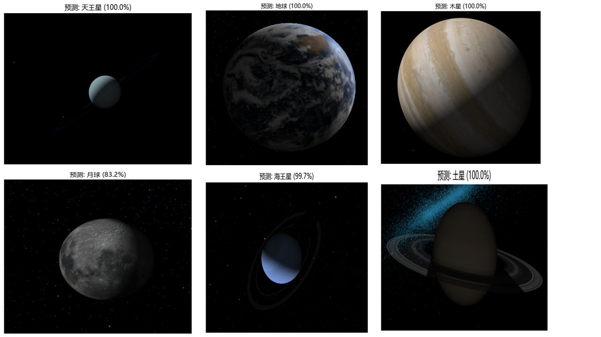
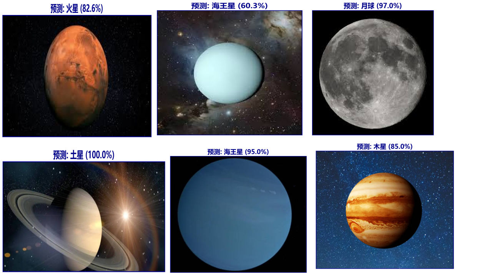

🎉 Welcome 👋



## Planetary Image Classification with Transfer Learning 🪐

Built an end-to-end pipeline with PyTorch + torchvision backbones (EfficientNet-B3 / ResNet50): data prep & augmentation → two-stage transfer learning → evaluation & interpretability (lightweight Grad-CAM) → batch/single inference with visual & CSV outputs. We have achieved 100% accurate recognition of Earth, Jupiter, Mars, Moon, Neptune, Saturn, and Uranus. 

  

## Research Background 📌 

Automatically classify planetary images into 7 classes (default: earth, jupiter, mars, moon, neptune, saturn, uranus). The pipeline is production-minded, reproducible, interpretable, and supports batch inference with visual reporting.

[//]: # ([![The template is mobile first with a responsive design to ensure that your site looks stunning on every device.]&#40;https://raw.githubusercontent.com/wowchemy/wowchemy-hugo-modules/main/starters/academic/preview.png&#41;]&#40;https://hugoblox.com&#41;)

## Research Methodology 🔍

1️⃣**Frameworks**: PyTorch, torchvision, scikit-learn, NumPy, Pandas, Matplotlib/Seaborn, OpenCV, TensorBoard  

2️⃣**Models**: Transfer learning (EfficientNet-B3 / ResNet50 pretrained), custom FC head (ReLU + Dropout)  

3️⃣**Training**: Two stages (freeze features → train head; unfreeze tail → fine-tune), cosine annealing + warmup, class weights, strong augmentations  

4️⃣**Evaluation**: Classification report, confusion matrices (raw/normalized), per-class accuracy, prediction grids, lightweight Grad-CAM  

5️⃣**Inference**: Batch prediction with visual outputs and CSV summary; showcase collage for blind-test mapping  

## Environment & Dependencies 💻

`pip install torch torchvision torchaudio --index-url https://download.pytorch.org/whl/cu121`  

`pip install scikit-learn numpy pandas matplotlib seaborn pillow tqdm opencv-python tensorboard`

**requirements**

torch  
torchvision  
torchaudio  
scikit-learn  
numpy  
pandas  
matplotlib  
seaborn  
pillow  
tqdm  
opencv-python  
tensorboard  

⚠️ The project has been uploaded to GitHub, You can access the source code and more details through this 👉[PlanetaryImageClassifier](https://github.com/knuxzq/PlanetaryImageClassifier) 🦄✨
   
    
